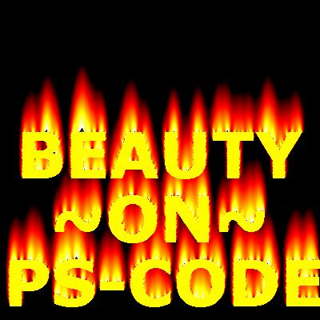



## Excellent Fire Effect with burning text\!

### Description

I have seen many fire effect but this is not a simple fire effect. have you ever seen a burning text i think you have never seen such effect alone and with text.Fire inside text,fire on top of text and a picture is worth of thousand of words just see the picture and feel the power of vb in graphics
 
### More Info
 

             |
---                |---
**Submitted On**   |2006-11-07 17:48:00
**By**             |[amarjit singh](https://github.com/Planet-Source-Code/PSCIndex/blob/master/ByAuthor/amarjit-singh.md)
**Level**          |Advanced
**User Rating**    |5.0 (10 globes from 2 users)
**Compatibility**  |VB 6\.0
**Category**       |[Graphics](https://github.com/Planet-Source-Code/PSCIndex/blob/master/ByCategory/graphics__1-46.md)
**World**          |[Visual Basic](https://github.com/Planet-Source-Code/PSCIndex/blob/master/ByWorld/visual-basic.md)
**Archive File**   |[Excellent\_2035891262006\.zip](https://github.com/Planet-Source-Code/amarjit-singh-excellent-fire-effect-with-burning-text__1-67306/archive/master.zip)

